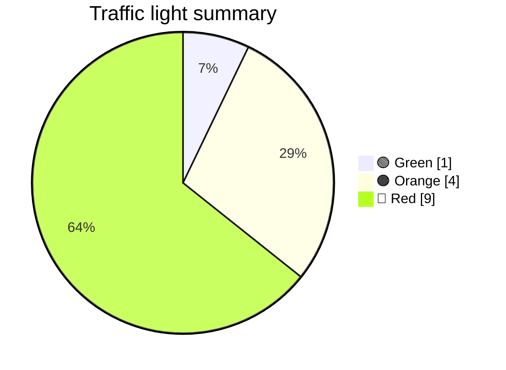

# Windows → Linux

Personal list of apps and tools that still keep me from switching Windows to Linux as a daily driver — because they don't run on Linux or lack good alternatives.

> Web versions don't count as replacements for me; this is about native desktop experience and workflow. The **Linux alternative** column still lists web wrappers and workarounds — with a short note on whether they're good enough for my use case.

**Last checked:** June 11, 2026 — another daily-driver test, result still disappointing.

**Bottom line:** Linux remains my dev, test, and tinkering environment.

### Traffic light

| | Meaning |
|---|---|
| 🟢 | Official Linux version **or** official PWA with full feature set |
| 🟠 | PWA with most features **or** original app runnable via Wine/Proton etc. |
| 🔴 | No Linux version · only alternatives with different features · only worse alternatives |

### Compatibility rating

Subjective score for how well Linux covers the same job today — independent of the traffic light above.

| Score | Meaning |
|-------|---------|
| 5/5 | Excellent — native/official, full workflow |
| 4/5 | Good — solid alternatives or minor gaps only |
| 3/5 | Fair — usable with workarounds or partial replacements |
| 2/5 | Poor — barely usable, major gaps |
| 1/5 | Blocked — not runnable on Linux |

---

## Productivity & Work

| | App | Why it matters | Linux status | Linux alternative | Compatibility |
|:-----:|-----|----------------|--------------|-------------------|:-------------:|
| 🔴 | **Microsoft Office** (esp. Excel) | Need native Excel for client solutions and live demos | ❌ No native Office | [LibreOffice Calc](https://www.libreoffice.org/), [ONLYOFFICE Desktop](https://www.onlyoffice.com/) — OOXML ok for basics, breaks on VBA, Power Query/Pivot; unusable for client demos. Workaround: Windows VM. | **1/5** — Spreadsheets yes, Excel-for-clients no |
| 🔴 | **Microsoft Power BI Desktop** | Reporting / BI workflow | ❌ Windows (and macOS) only | [Metabase](https://www.metabase.com/), [Apache Superset](https://superset.apache.org/), [Grafana](https://grafana.com/) — different BI stacks, no `.pbix`, no DAX/M. Workaround: Windows VM. | **1/5** — Other BI tools, not Power BI |
| 🟠 | **Microsoft Teams** (Desktop) | Customer support — desktop client has to feel right | ❌ Official Linux client discontinued (Dec. 2022) | [Teams PWA](https://www.microsoft.com/en-us/microsoft-teams/download-app) (official, Edge/Chrome) — most features, not full desktop parity; [teams-for-linux](https://github.com/IsmaelMartinez/teams-for-linux) unofficial. | **3/5** — Official PWA fine for chat/calls; power-user gaps |
| 🔴 | **WorkingHours** | Main time-tracking app | ❌ Windows, macOS, Android, iOS only | [Furtherance](https://github.com/unobserved-io/Furtherance), [TimeWorm](https://github.com/instantolap/timeworm), [ZeroClock](https://apps.lashman.live/zeroclock/), [Toggl Track](https://toggl.com/track/) — different apps, no feature parity. | **3/5** — Good trackers exist, not WorkingHours |

## Tools & Hardware

| | App | Why it matters | Linux status | Linux alternative | Compatibility |
|:-----:|-----|----------------|--------------|-------------------|:-------------:|
| 🔴 | **ShareX** | Screenshots & screen recording — fast, flexible, best tool for me | ⚠️ No ShareX, replacements exist | [ShotX](https://github.com/vedesh-padal/ShotX) / [SnapX](https://github.com/SnapXL/SnapX) — screenshot + recording in one app; [Flameshot](https://flameshot.org/) for capture-only. ShareX-level upload automation still ahead. | **4/5** — One-app capture + record is covered; polish/automation behind ShareX |
| 🔴 | **Elgato Stream Deck** | Controls hardware on my desk (1 device) | ⚠️ No Elgato software | [OpenDeck](https://github.com/nekename/OpenDeck), [StreamController](https://github.com/StreamController/StreamController) — unofficial, beta, plugin gaps. | **3/5** — OpenDeck viable; unofficial, not every plugin |
| 🔴 | **Logitech G HUB** | 4 devices: updates, control, battery status | ❌ No Linux client | [Solaar](https://github.com/pwr-Solaar/Solaar), [Piper](https://github.com/libratbag/piper)/[libratbag](https://github.com/libratbag/libratbag) — no firmware updates, limited features. | **2/5** — Basic config/battery; no firmware, incomplete for G ecosystem |
| 🟠 | **WhatsApp Desktop** | Everyday messaging | ❌ No official Linux client | PWA / WhatsApp Web (most chat features); wrappers [Whatsie](https://flathub.org/apps/com.ktechpit.whatsie), [Karere](https://github.com/tobagin/karere), [whatRust](https://github.com/karem505/whatRust) — unofficial. | **4/5** — Messaging/calls via PWA or wrapper work well |

## Gaming

| | App | Why it matters | Linux status | Linux alternative | Compatibility |
|:-----:|-----|----------------|--------------|-------------------|:-------------:|
| 🔴 | **League of Legends** *(Teamfight Tactics only)* | I only need the Riot client for TFT | ❌ Unplayable since Vanguard (Apr. 2024) | No Wine/Proton workaround — [Riot Vanguard](https://www.riotgames.com/en/vanguard) requires a Windows kernel driver (same client for LoL and TFT). Only option: [GeForce NOW](https://www.nvidia.com/en-us/geforce-now/) etc. (streaming, not local). | **1/5** — Blocked locally; cloud streaming only |
| 🟠 | **Magic: The Gathering Arena** | Play regularly; base for tracker tools | ⚠️ No native Linux | [Steam + Proton](https://store.steampowered.com/app/2141910/Magic_The_Gathering_Arena/) — [ProtonDB](https://www.protondb.com/app/2141910) “Playable”, but updates/patches often break things (black screen, switch Proton version). Also possible via Lutris/Wine. | **3/5** — Playable via Proton; patch/version roulette |
| 🟢 | **17Lands Client** | MTG Arena — draft/meta tracking | ✅ Official Linux client (Python) | `pip install seventeenlands` — [official guide](https://www.17lands.com/getting_started). Manual log path when Arena runs via Steam/Proton. | **4/5** — Official client; extra setup for Proton log path |
| 🟠 | **Untapped.gg Client** | MTG Arena — stats & overlay | ❌ No native Linux client | Original app via [Protontricks/wine_untappedgg_companion](https://github.com/sabedevops/wine_untappedgg_companion); overlay often broken on Wayland. Replacement: [MTG Arena Tool](https://mtgatool.com/) (native, but different product). | **2/5** — Proton workaround fragile; overlay unreliable |

### Traffic light summary

